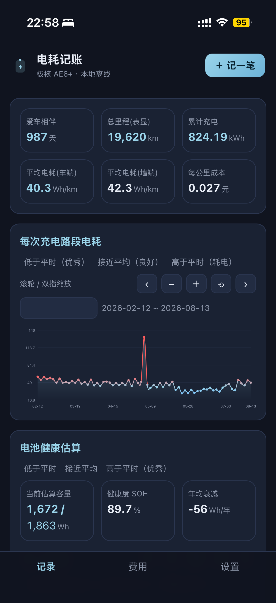
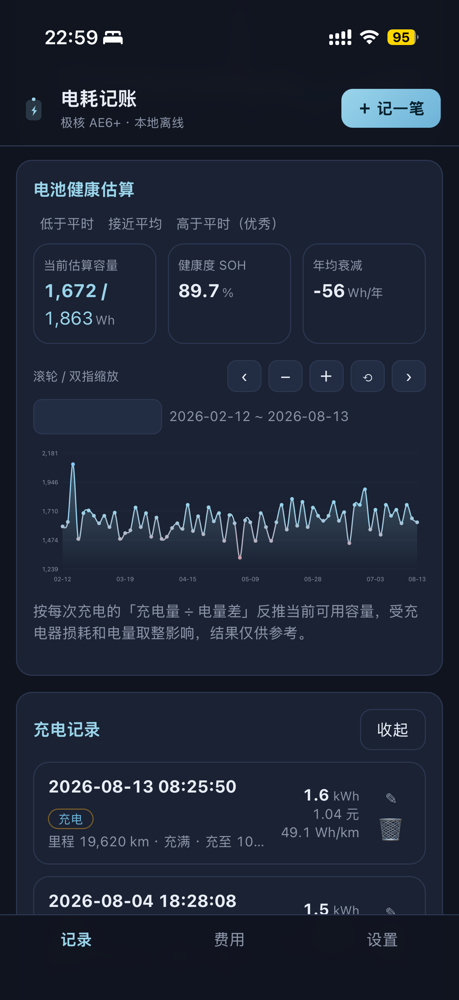
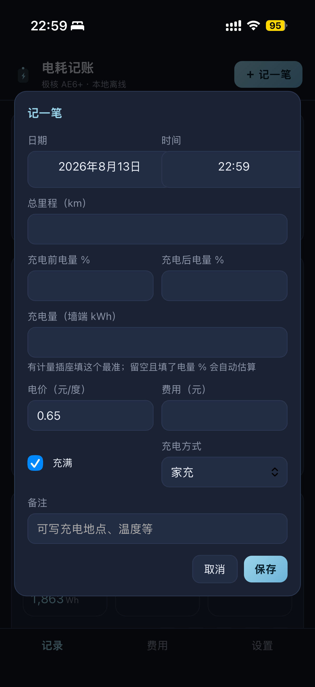
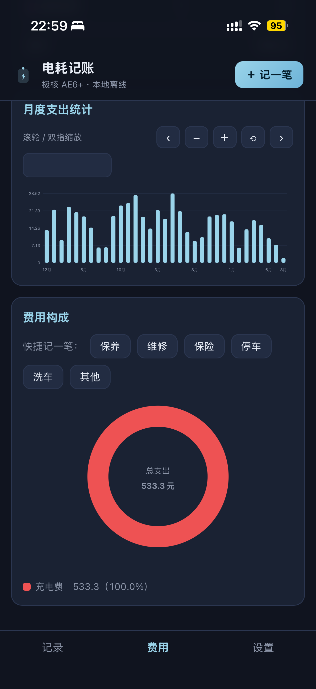
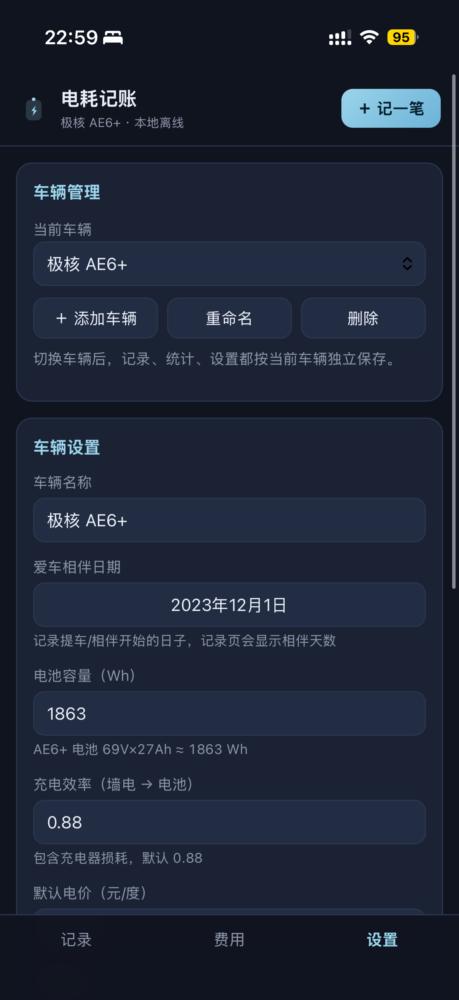
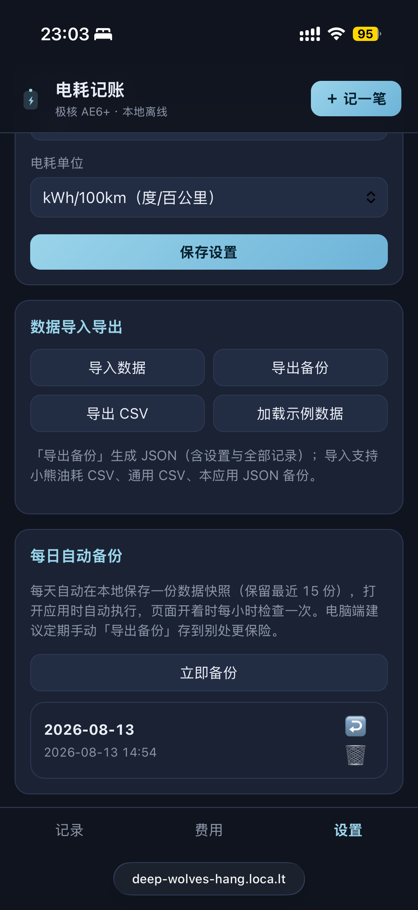
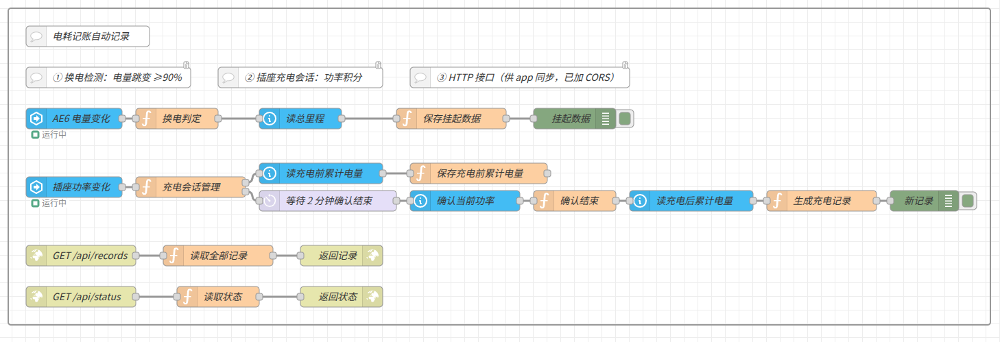

# 电耗记账（极核 AE6+ 自用版）

一个完全离线的单页应用，用「记账」的方式记录两轮电动车的充电，自动算电耗和成本，支持从小熊油耗导出的 CSV 导入数据。数据只存在浏览器本地（localStorage），不会上传到任何服务器。

## 截图

| 记录（概览） | 记录（充电明细） |
| --- | --- |
|  |  |

| 记一笔 | 费用 |
| --- | --- |
|  |  |

| 设置 | 备份 |
| --- | --- |
|  |  |

## 功能

界面分三个页签：**记录 / 费用 / 设置**，顶部「＋ 记一笔」随时记账。

### 记录页

- **记一笔**：日期、总里程、充电前后电量 %、充电量（墙端 kWh）、电价、费用、是否充满、充电方式、备注。充电量/电价/费用三者填任意两个自动算第三个；不填充电量但有电量 % 时按电池容量和充电效率自动估算。
- **自动算电耗**：相邻两次充电之间的里程差即路段距离；车端电耗优先用前后电量百分比差计算（不依赖充电效率），没有电量数据时用「墙端充电量 × 充电效率」。
- **统计卡片**：爱车相伴天数、总里程（表显，Node-RED 连接时取实时值）、预计续航（按当前电量与平均电耗推算）、累计充电度数、平均电耗（墙端）、每公里成本。
- **电池健康估算**：根据每次充电的「充电量 ÷ 电量差」反推当前可用容量，三张卡片一行显示当前估算容量（含标称对比，如 1672 / 1863 Wh）、健康度 SOH（%）和年均衰减（Wh/年），曲线可看容量变化趋势；受充电器损耗和电量取整影响，结果仅供参考。
- **图表交互**：电耗曲线平滑显示，并按三段渐变着色（低于平均=蓝/优秀，接近平均=冰蓝/良好，高于平均=红/耗电；电池健康曲线方向相反）；折线图与柱状图**默认显示最近半年**，点 ⟲ 回到近半年视图，用 − 缩小或 ‹ › 翻页可看更早数据；鼠标悬浮或手指在图表上滑动时，会浮现当前所指位置的日期/月份、数值和水平判断；时间轴支持滚轮/双指捏合（以手指或指针所指位置为锚点）缩放、单指/左键拖动平移，另有 ‹ − ＋ ⟲ › 按钮翻页缩放和日期选择框直接跳转；已禁用浏览器页面级缩放，缩放状态切换页面后保留。
- **充电记录列表**：默认只显示最近 3 条（新的在前），可一键展开全部；每条可编辑、删除。

### 费用页

- **记费用**：保养、保险、停车、维修、配件等支出，类型可自定义；工具栏可一键**导出本月报告**（次数/度数/费用/里程/电耗）。
- **月度预算**：设置里填写预算后，费用页显示本月支出与预算对比，超支红色提醒。
- **各项费用统计**：充电费 + 各费用类别的笔数与金额汇总表。
- **月度支出统计**：每月总支出（充电费 + 其他费用）柱状图。
- **费用构成**：环形图展示各项支出占比，每个项目有独立颜色（同类固定同色，统计表带同款色点），面板内带「保养 / 维修 / 保险 / 停车 / 洗车 / 其他」快捷记一笔按钮，点一下直接弹出对应类型的记账表单。

### 设置页

- **车辆管理**：支持多辆车，可添加、切换、重命名、删除；每辆车的记录、统计、设置完全独立，顶部显示当前车辆。
- **Node-RED 自动记录同步**：配合 Home Assistant + Node-RED 自动记录插座充电（换电跳变检测、电量表差值算度数、充后电量自动回填、HA 通知），app 内可填接口地址，**打开应用自动同步**，也可一键同步/检查连接。
- 当前车辆的名称、**爱车相伴日期**、电池容量、充电效率、默认电价、电耗单位、**月度充电预算**。
- **浅色模式**：跟随系统自动切换（浅色/深色）。
- **导入数据**：支持本应用 JSON 备份、小熊油耗官方 CSV 导出（油耗记录 12 字段 / 费用记录 5 字段）、通用 CSV（表头自动识别）。
- **导出备份**：JSON 完整备份（含设置与全部记录）；另有 CSV 导出。
- **每日自动备份**：每天自动在本地保存一份数据快照（保留最近 15 份），打开应用时执行、页面开着每小时检查；可随时「立即备份」，每条快照支持**单独导出成 JSON** 和**一键恢复**，还可开启「每天自动下载备份文件」把当天备份落地到设备。
- 加载示例数据。

**PWA**：用手机浏览器打开后可「添加到主屏幕」，像 APP 一样用，离线可用。

## Home Assistant / Node-RED 自动记录（可选）

两电池交替使用时，可让 Home Assistant + Node-RED 自动记录每一次充电，app 一键同步。流程文件在仓库 `node-red/electric-log-flow.json`。



### 使用步骤

1. **导入流程**：Node-RED 菜单 → 导入 → 选择 `node-red/electric-log-flow.json` → 部署；
2. **修改实体**：把 4 个实体 ID 换成你自己的（见下表）；`server-state-changed` 和 `api-current-state` 节点若提示，重新选择你的 HA 服务器；
3. **暴露 fs**（Node-RED v4 必须）：在 `settings.js` 的 `functionGlobalContext` 里加一行 `fs: require('fs'),`，重启容器，否则接口会挂起；
4. **反代（可选）**：Nginx Proxy Manager 加两个 Custom Location：`/api/records`、`/api/status` → 指向 Node-RED 地址；
5. **app 同步**：设置页「Node-RED 自动记录同步」填接口地址（如 `http://nas:1880/api/records` 或反代后的 https 地址；接口带令牌时在地址后加 `?token=你的令牌`）→ 检查连接 → 同步记录。

### 实体配置（通用）

| 数据 | 需要的实体（示例名称，按你的替换） |
| --- | --- | --- |
| 车上电量（0–100） | 电量传感器（如 `sensor.battery_level`） |
| 总里程 | 累计里程传感器（如 `sensor.total_odometer`） |
| 插座功率（W） | 功率传感器（如 `sensor.charger_power`） |
| 累计电量（kWh） | 能量累计传感器（如 `sensor.charger_energy`） |

### 工作流程

1. 电量从 <90% 跳到 ≥90% → 判定新电池装车，把跳变前电量与总里程存入挂起文件；
2. 插座功率 >8W 开始充电会话（记录累计电量起始值），<8W 持续 2 分钟确认结束；
3. 结束读数 − 开始读数 = 本次充电度数（读数异常时回退到功率积分）；
4. 充电电量 <0.5 kWh 视为插座用于其他设备，忽略并保留挂起数据；
5. 正常结束生成一条记录追加到 `records.jsonl`，同时删除挂起数据；装回电池时用实际电量回填上条记录的充后电量。
6. 换电、开始充电、充电完成/疑似他用都会发送 HA 通知（默认 `notify.persistent_notification`，可改成手机通知服务）。

### 文件与接口

- 数据目录（容器内）：`/data/electric-log/`（可改），包含：
  - `pending_swap.json`：挂起换电数据（防 Node-RED 重启丢失）
  - `charging_session.json`：进行中的充电会话
  - `records.jsonl`：最终记录（一行一条 JSON）
- HTTP 接口（Node-RED 内置）：`GET /api/records`、`GET /api/status`（含当前电量与里程）、`POST /api/backup`（app 备份推送到 NAS，保存为 `app_backup_日期.json`）

### 可调参数

都在流程函数节点里：跳变阈值 90%、功率阈值 8W、结束确认 2 分钟、<0.5 kWh 忽略线、电价 0.65 元/度、功率单位 W / 电量单位 kWh（实体若是 kW/Wh 改对应系数）。

## 怎么运行

### 方式一：直接打开

双击 `index.html`，用 Chrome / Edge / Safari 打开即可使用（数据保存在浏览器里）。

### 方式二：本地服务器（推荐，手机也能用）

```bash
cd energy-tracker
python3 -m http.server 8000
```

电脑浏览器访问 `http://localhost:8000`；手机和电脑连同一个 Wi-Fi 时，访问 `http://电脑局域网IP:8000`（手机浏览器打开后可选择「添加到主屏幕」）。

## 从小熊油耗导入

小熊油耗的 `.bak` 备份是私有格式，无法直接解析；官方开放的是 **CSV 导入导出**：

1. 在小熊油耗里进入「我的 → 备份和恢复」（或设置）→ 导出油耗数据到 CSV。会生成 `fuel-eco-<编号>-UTF-8.csv`；费用记录另导出 `expense-<编号>-UTF-8.csv`。
2. 把 CSV 文件拷贝到电脑/手机。
3. 打开本应用 → 顶部「导入」→ 选择文件（可一次选多个）→ 确认导入。

CSV 12 字段格式（与官方文档一致）：

```
日期,时间,里程,油价,费用,油耗,是否加满,燃油类型,备注,是否上次忘记记录,是否油灯亮了,加油站
2026-07-20,20:13:24,1240,0.60,1.09,15.2,1,家充,首次记录,0,0,自家插座
```

导入后「油价」按电价（元/度）理解，「油耗」按电耗（度/百公里）理解；充电量 = 费用 ÷ 电价 自动反推。

## 通用 CSV 表头（也支持）

```
日期,时间,里程,充电量,费用,电价,充电前电量,充电后电量,充满,充电方式,备注,站点
```

表头名称可以换说法，例如「总里程」「金额」「单价」「充电前剩余电量」等都会自动识别。

## 计算口径

- **车端电耗**：相邻两次充电间，电池实际消耗的电量 ÷ 行驶里程。优先用 `电池容量 × (上次充后% − 本次充前%) / 100`，没有电量数据时用 `本次墙端充电量 × 充电效率`。
- **墙端电耗/成本**：直接按本次充电量（计量插座读数）和费用统计，用来算「每公里多少钱」最贴合实际。
- 充电效率默认 0.88（充电器损耗约 12%），可在设置里改；电池容量默认 1863 Wh（69V × 27Ah），也按实际改。

## 数据备份

数据存在浏览器 localStorage 里。应用每天会自动保存一份本地快照（保留最近 15 份，可在设置页查看和恢复）；设置了 Node-RED 地址后，每日备份还会同步推送一份到 NAS（保存为 `app_backup_日期.json`），本地快照始终保留、推送失败不影响。但浏览器缓存被清仍可能丢失本地数据，电脑端建议定期点「导出备份」把 JSON 存到别处。换手机/浏览器时点「导入」选择备份文件即可恢复（v1 单车辆旧备份也兼容）。

## 测试

```bash
cd energy-tracker
node tests/run.test.mjs
```

覆盖：CSV 解析、小熊油耗两种 CSV 导入、通用 CSV、JSON 备份往返、路段电耗算法、汇总统计。

## 文件结构

```
energy-tracker/
├── index.html            主页面
├── css/style.css         样式
├── js/
│   ├── util.js           工具函数
│   ├── importer.js       导入导出解析（小熊油耗 CSV / JSON / 通用 CSV）
│   ├── calc.js           电耗计算引擎
│   ├── charts.js         SVG 图表
│   └── app.js            界面交互
├── manifest.webmanifest  PWA 配置
├── sw.js                 离线缓存
├── icon.svg              应用图标
├── samples/              小熊油耗 CSV 示例、本应用 JSON 备份示例
├── screenshots/          应用截图
├── node-red/electric-log-flow.json  Node-RED 自动记录流程（导入用）
└── tests/run.test.mjs    自动化测试
```

## 作者

[MX10085](https://github.com/MX10085)
